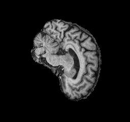
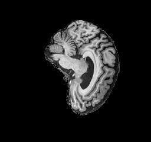
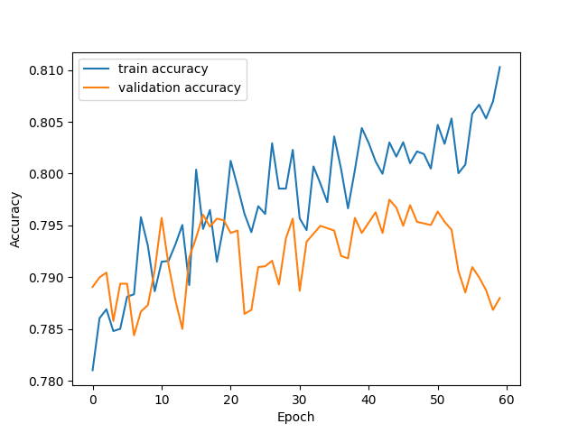
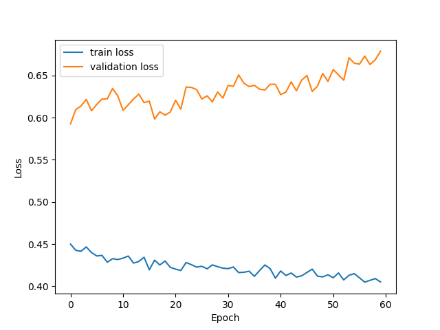

# Problem Description
The goal of this project is to diagnose Alzheimer's from a 2D MRI scan accurately using a visual transformer network. The data used was obtained from the "Alzheimer's Disease Neuroimaging Initiative" or ADNI dataset. Here are some samples:

<pre>
Alzheimer's                         Normal Brain
</pre>

# The Visual Transformer

The structure of the transformer was based off of the paper, "An Image is Worth 16x16 Words: Transformers for Image Recognition at Scale". The network has 3 distinct parts:

1): Embeddings: The images are cut up into patches, the patches are flattened, and each patch is fed into a single layer linear network to embed them. The idea here is that the network can learn a linear projection of the patches that is advantagious for classification. After the patches are projected, each embedded patch has its index in the sequence of patches added to it, called a positional encoding, this is to retain contextual information in the image, and was found in the paper to be advantagious for performance. Alongside these linear embeddings with positional encodings, there is an extra learned parameter, a "class embedding" added to position 0. This class embedding is what is used to classify the image after the transformer blocks.

2): Transformer Encoder: The structure of the encoder is on the right hand side of the image above. The "Norm" blocks are layernorm, standard in transformers. The skip connections are to stop the gradient signal from dying off and not effecting nodes at the start of a deep network. The mlp block at the end of the encoder exists so the model can learn to transform the output of the multi head attention into something maybe more useful for the next transformer encoder block. The multi-head (self) attention, however, is really the thing that makes this whole network work.

Multi-head self attention allows the network to find correlations between image patches that help it classify the image. It works by learning linear projections of the image patches for each head to convert them into keys, queries, and values, and then calculating attention on these and then concatenating them back together and then applying a learned linear projection again. This layer learns the weights that allow it to relate key parts of the image with eachother.

The transformer encoder is repeated multiple times in the network structure usually.

3): MLP Head: This plays the same role as it would in a convolutional network, the transformer encoder blocks are essentially learned feature extraction, these dense layers take in the output of the transformer encoder and use it to classify the image as either a positive Alzeimer's case or a negative.

# Training
The hyperparameters and model structure configuration are in train.py

The train and test splits were already done in the dataset downloaded off of the COMP3710 uq blackboard course website. The split was 9000 test points, and 21520 train points.

Each patient in the data set had 20 mri scans of their brain.

The validation set was produced by taking 216 patients, 108 with alzheimers and 108 without, (so 4320 or 20% of the train set). The validation split was done on a per patient basis to avoid data leakage from the train set into the validation set. If a patient appeared half in the validation set and half in the train set, the model might just remember the general brain shape or skull shape to get the alzheimer's classification right, giving a deceptively high validation accuracy, rather than looking in the correct places.

The images were cropped to be square, scaled to have its pixel values between 0 and 1, as well as normalised before use. No flipping or rotating of the images were used since all the brain MRIs appear with the same orientation and are photographed from the same side.

After training for 60 epochs the loss and accuracy curves were observed

 

At first the performance of the validation set is better than the train set, this is due to dropout. Neuron weights are being killed during training which hinders performance, then being all switched on during validation. However the validation
performance eventually starts to slowly get worse, while the training performance continues to increase, overfitting. The correct epoch to stop to maximise test performance would be somewhere around the 20 epoch mark.

 

# Results

Retraining the model and stopping at epoch 20 gave a test set accuracy of 67%

# Requirements to Run and Libraries Used

The model was trained on a a100 gpu node and took 66 minutes to train for the whole 60 epochs, and 21 minutes to train for the 20 epochs.

The torch and torchvision libraries were used. The data in its form used for training was obtained in its current form from the COMP3710 course blackboard website and is inaccessable to the general public. However the ADNI dataset is available to everyone, but is likely not in a form suitable for dataset.py. So if someone wanted to reproduce the results they would need to download the data themselves and make their own torch.utils.data.Dataset object with it.

#License

